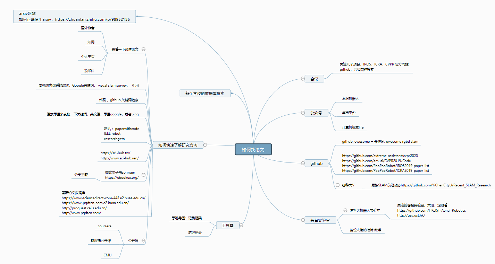
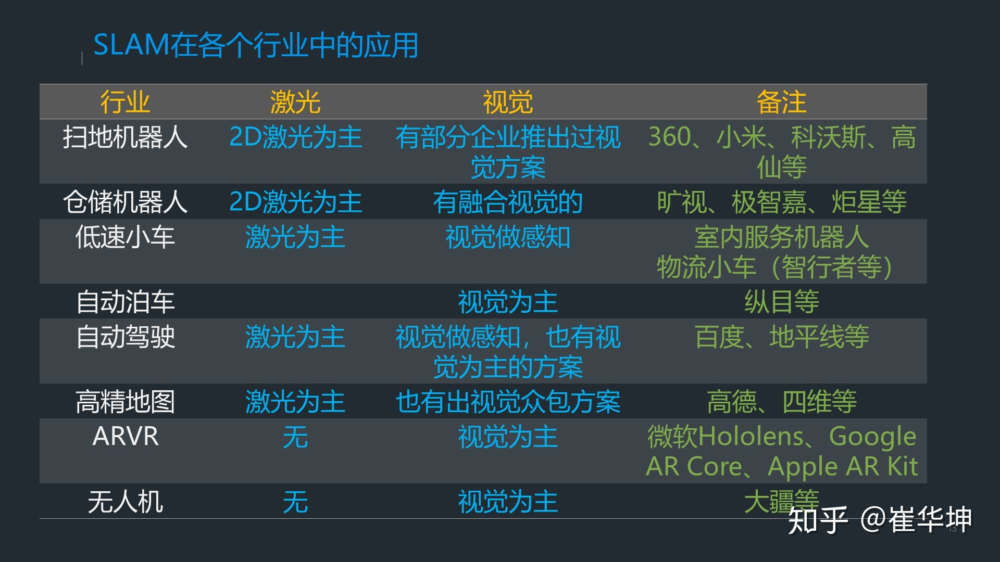

本人研究方向是视觉SLAM，针对感兴趣的内容进行总结：

1. ORB-SLAM2算法:  源码及其改进；
2. Line-SLAM：paper及其源码；
3. 经典SLAM算法： 经典、优秀的开源工程 ；
4. 科研工具 ：论文或实验用到的一些工具；
5. 优秀作者和实验室：自己感兴趣的大佬和实验室；
6. 学习材料：入门学习SLAM学习资料；
7. SLAM、三维重建相关资源：常用的 Github 仓库，如何找论文；
8. SLAM应用和企业:包含SLAM的应用，及其招聘公司的公司（名单可能不完善）；
9. 工作面试：包含SLAM算法面试的时候准备经验；
### 目录
<!-- TOC -->
[一、ORB SLAM及其改进](#一orb-slam及其改进)
- [1. 加入点线特征](#1-加入点线特征)    
 - [2. 加入IMU](#2-加入imu)  
  - [3. 加入wheel Odometer](#3-加入wheel-odometer)   
  - [4. 改进直接法](#4-改进直接法)   
   - [5. 加入Odometer和gyro](#5-加入odometer和gyro)  
   - [6. ORB-SLAM2 + 目标检测/分割的方案语义建图](#6-orb-slam2--目标检测分割的方案语义建图) 
   - [7. 增加鱼眼相机模型](#7-增加鱼眼相机模型)   
   - [8. 其他的改变](#8-其他的改变)  
 
 [二、line-SLAM](#二line-slam)
 
 [三、经典SLAM系统](#三经典slam系统) 
   - [3.1 VSLAM](#31-vslam)     
     - [1. PTAM](#1-ptam)    
     - [2. S-PTAM（双目 PTAM）](#2-s-ptam双目-ptam)      
     - [3. MonoSLAM](#3-monoslam)      
     - [4. ORB-SLAM2](#4-orb-slam2)      
     - [5. DSO](#5-dso)  
     - [6. LDSO](#6-ldso)      
     - [7. LSD-SLAM](#7-lsd-slam)       
     - [8. DVO-SLAM](#8-dvo-slam)
     - [9. SVO](#9-svo)     
     - [10. openvslam](#10-openvslam)   
   - [3.2   VIO](#32---vio)       
     - [1. msckf_vio](#1-msckf_vio)      
     - [2. rovio](#2-rovio)        
     - [3. R-VIO](#3-r-vio)       
     - [4. okvis](#4-okvis)        
     - [5. VIORB](#5-viorb)       
     - [6. VINS-mono](#6-vins-mono)        
     - [7. VINS-RGBD](#7-vins-rgbd)      
     - [8. Open-VINS](#8-open-vins)   

   [四、优秀作者与实验室](#四优秀作者与实验室)    
   - [4.1 **Julian Straub MIT,facebook VR 实验室**](#41-julian-straub-mitfacebook-vr-实验室)    
   - [4.2 **牛津大学 Duncan Frost（PTAM 课题组）**](#42-牛津大学-duncan-frostptam-课题组)     
   - [4.3 **Yoshikatsu NAKAJIMA (中島 由勝)**](#43-yoshikatsu-nakajima-中島-由勝)     
   - [4.4 **Alejo Concha（苏黎世Oculus VR）**](#44-alejo-concha苏黎世oculus-vr)     
   - [4.5 **波兹南理工大学移动机器人实验室**](#45-波兹南理工大学移动机器人实验室)     
   - [4.6  **Xiaohu Lu**](#46--xiaohu-lu)     
   - [4.7 **澳大利亚机器人视觉中心 Yasir Latif**](#47-澳大利亚机器人视觉中心-yasir-latif)     
   - [4.8 **西班牙马拉加大学博士生：RubénGómezOjeda**](#48-西班牙马拉加大学博士生rubéngómezojeda)     
   - [4.9**法国运输，规划和网络科学与技术研究所博士：Nicolas Antigny**](#49法国运输规划和网络科学与技术研究所博士nicolas-antigny)     
   - [4.10 **三星 AI 实验室（莫斯科）：Alexander Vakhitov**](#410-三星-ai-实验室莫斯科alexander-vakhitov)     
   - [4.11 **苏黎世联邦理工学院计算机视觉与几何实验室：Prof. Marc Pollefeys**](#411-苏黎世联邦理工学院计算机视觉与几何实验室prof-marc-pollefeys)    
   - [4.12 **香港中文大学机器人、感知与 AI 实验室**](#412-香港中文大学机器人感知与-ai-实验室)     
   - [4.13 **微软高级工程师、苏黎世联邦理工：Johannes L. Schönberger**](#413-微软高级工程师苏黎世联邦理工johannes-l-schönberger)     
   - [4.14  **美国犹他大学计算机学院：Srikumar Ramalingam**](#414--美国犹他大学计算机学院srikumar-ramalingam)     
   - [4.15 **德国马克斯普朗克智能系统研究所：Jörg Stückler**](#415-德国马克斯普朗克智能系统研究所jörg-stückler)     
   - [4.16  **麻省理工学院航空航天控制实验室**](#416--麻省理工学院航空航天控制实验室)     
   - [4.17 **约翰·霍普金斯大学计算机系博士 Long Qian**](#417-约翰·霍普金斯大学计算机系博士-long-qian)     
   - [4.18 **佐治亚理工学院机器人与机器智能研究所**](#418-佐治亚理工学院机器人与机器智能研究所)     
   - [4.19  其他实验室和大牛补充](#419--其他实验室和大牛补充) -  

   [五、科研工具](#五科研工具)     
   - [5.1  Linux](#51--linux)     
   - [5.3 **Shell**](#53-shell)     
   - [5.4  Vim](#54--vim)     
   - [5.5 Cmake](#55-cmake)     
   - [5.6  Git&Github](#56--gitgithub)    
   - [5.7 **GDB**](#57-gdb)     
   - [5.8 pangolin](#58-pangolin)     
   - [5.10 C++](#510-c) - 
   
   [六、学习材料](#六学习材料) - 
   
   [七、SLAM、三维重建相关资源](#七slam三维重建相关资源)     
   - [7.1.常用的GitHub地址](#71常用的github地址)    
   - [7.2.找论文图（SLAM研学社）](#72找论文图slam研学社) - 
   
   [八、SLAM应用和企业](#八slam应用和企业) - 
   
   [九、工作面经](#九工作面经) - 

   [十、主要参考](#十主要参考)
   <!-- /TOC -->
#### 一、ORB SLAM及其改进

​    paper: [**ORB-SLAM2: an Open-Source SLAM System for Monocular, Stereo and RGB-D Cameras**](  https://128.84.21.199/pdf/1610.06475.pdf  )

​    code：ORB-SLAM: [https://github.com/raulmur/ORB_SLAM ](https://github.com/raulmur/ORB_SLAM). (Monocular. [ROS](http://www.ros.org/) integrated)

​    paper:[**ORB-SLAM: A Versatile and Accurate Monocular SLAM System**]( http://webdiis.unizar.es/~raulmur/MurMontielTardosTRO15.pdf )

​    code：ORB-SLAM2: [https://github.com/raulmur/ORB_SLAM2 ](https://github.com/raulmur/ORB_SLAM2). (Monocular, Stereo, RGB-D. [ROS](http://www.ros.org/) optional)

##### 1. 加入点线特征

* **paper**:https://github.com/atlas-jj/ORB_Line_SLAM （线）

* **paper**:https://github.com/maxee1900/RGBD-PL-SLAM （点线）

* **paper**: [PL-SLAM: a Stereo SLAM System through the Combination of Points and Line Segments](http://mapir.isa.uma.es/mapirwebsite/index.php/people/164-ruben-gomez)

  **code**: https://github.com/rubengooj/pl-slam

* https://github.com/lanyouzibetty/ORB-SLAM2_with_line 

* https://github.com/maxee1900/RGBD-PL-SLAM (RGBD-SLAM with Point and Line Features, developed based on the famous ORB_SLAM2)

* https://github.com/yan-lu/LineSLAM 

##### 2. 加入IMU

* **paper**: [Visual-Inertial Monocular SLAM with Map Reuse]( https://arxiv.org/abs/1610.05949 )

* **code**:https://github.com/jingpang/LearnVIORB（ROS）

  ​          https://github.com/ZuoJiaxing/Learn-ORB-VIO-Stereo-Mono (非ROS)

* **code**:https://github.com/gaoxiang12/ygz-stereo-inertial （  uses a LK optical flow as front-end and a sliding window bundle adjustment as a backend ）

##### 3. 加入wheel Odometer

* **paper**: [**Gyro-Aided Camera-Odometer Online Calibration and Localization**]( https://ieeexplore.ieee.org/document/7963501 

  **code**:  https://github.com/image-amazing/Wheel_Encoder_aided_vo 

* **paper**：Zheng F, Liu Y H. [**Visual-Odometric Localization and Mapping for Ground Vehicles Using SE (2)-XYZ Constraints**](https://ieeexplore.ieee.org/abstract/document/8793928)[C]//2019 International Conference on Robotics and Automation (**ICRA**). IEEE, **2019**: 3556-3562.

  **code**：https://github.com/izhengfan/se2lam

* **paper**：Zheng F, Tang H, Liu Y H. [**Odometry-vision-based ground vehicle motion estimation with se (2)-constrained se (3) poses**](https://ieeexplore.ieee.org/abstract/document/8357438/)[J]. IEEE transactions on cybernetics, **2018**, 49(7): 2652-2663.

  **code**：https://github.com/izhengfan/se2clam

##### 4. 改进直接法

* **code**：https://github.com/gaoxiang12/ORB-YGZ-SLAM （ put the direct tracking in SVO to accelerate the feature matching in ORB-SLAM2 ）

##### 5. 加入Odometer和gyro

- **paper**： [Tightly-coupled Monocular Visual-odometric SLAM using Wheels and a MEMS Gyroscope](https://arxiv.org/pdf/1804.04854.pdf )

#####  6. ORB-SLAM2 + 目标检测/分割的方案语义建图

- https://github.com/floatlazer/semantic_slam
- https://github.com/qixuxiang/orb-slam2_with_semantic_labelling
- https://github.com/Ewenwan/ORB_SLAM2_SSD_Semantic

##### 7. 增加鱼眼相机模型

* [Fisheye-ORB-SLAM, A real-time robust monocular visual SLAM system based on ORB-SLAM for fisheye cameras, without rectifying or cropping the input images](https://github.com/lsyads/fisheye-ORB-SLAM)

##### 8. 其他的改变

* [ORBSLAM2_with_pointcloud_map](https://github.com/gaoxiang12/ORBSLAM2_with_pointcloud_map)

* [ORB-SLAM2_RGBD_DENSE_MAP](https://github.com/tiantiandabaojian/ORB-SLAM2_RGBD_DENSE_MAP)

* [Save and load orb-slam2 maps](https://github.com/AlejandroSilvestri/osmap)

* [ORB_SLAM2 with map load/save function](https://github.com/Jiankai-Sun/ORB_SLAM2_Enhanced)

* [Viewer for maps from ORB-SLAM2 Osmap](https://github.com/AlejandroSilvestri/Osmap-viewer)

* 不同平台

  [Windows version ORBSLAM2,Easy built by visual studio](https://github.com/phdsky/ORBSLAM24Windows)

  [ORB-SLAM-Android, test on Sony Xperia Z](https://github.com/castoryan/ORB-SLAM-Android)

  [ORBSLAM2 on Mac OSX](https://github.com/meiroo/ORBSLAM2-OSX)

  [ROS interface for ORBSLAM2](https://github.com/ethz-asl/orb_slam_2_ros)

#### 二、line-SLAM

* **paper**:  Yijia H , Ji Z , Yue G , et al. PL-VIO: Tightly-Coupled Monocular Visual–Inertial Odometry Using Point and Line Features[J]. Sensors, 2018, 18(4):1159-. 

​      **code**:  https://github.com/HeYijia/PL-VIO 

* **paper**: Gomez-Ojeda R , Briales J , Gonzalez-Jimenez J . [PL-SVO: Semi-direct Monocular Visual Odometry by combining points and line segments]( http://mapir.isa.uma.es/rgomez/publications/iros16plsvo.pdf )[C]// IEEE/RSJ International Conference on Intelligent Robots & Systems. IEEE, 2016. 

  **code**：https://github.com/rubengooj/pl-svo 

* **paper**: Gomez-Ojeda R , Gonzalez-Jimenez J . [Robust stereo visual odometry through a probabilistic combination of points and line segments]( http://ieeexplore.ieee.org/document/7487406/ )[C]// 2016 IEEE International Conference on Robotics and Automation (ICRA). IEEE, 2016. 

* **paper**: [PL-SLAM: a Stereo SLAM System through the Combination of Points and Line Segments](http://mapir.isa.uma.es/mapirwebsite/index.php/people/164-ruben-gomez)

  **code**: https://github.com/rubengooj/pl-slam

#### 三、经典SLAM系统

##### 3.1 VSLAM

###### 1. PTAM

- **论文**：Klein G, Murray D. [**Parallel tracking and mapping for small AR workspaces**](http://www.robots.ox.ac.uk/ActiveVision/Publications/klein_murray_ismar2007/klein_murray_ismar2007.pdf)[C]//Mixed and Augmented Reality, 2007. ISMAR 2007. 6th IEEE and ACM International Symposium on. IEEE, **2007**: 225-234.
- **代码**：https://github.com/Oxford-PTAM/PTAM-GPL
- 工程地址：http://www.robots.ox.ac.uk/~gk/PTAM/
- 作者其他研究：http://www.robots.ox.ac.uk/~gk/publications.html

###### 2. S-PTAM（双目 PTAM）

- **论文**：Taihú Pire,Thomas Fischer, Gastón Castro, Pablo De Cristóforis, Javier Civera and Julio Jacobo Berlles. [**S-PTAM: Stereo Parallel Tracking and Mapping**](http://webdiis.unizar.es/~jcivera/papers/pire_etal_ras17.pdf). Robotics and Autonomous Systems, **2017**.
- **代码**：https://github.com/lrse/sptam
- 作者其他论文：Castro G, Nitsche M A, Pire T, et al. [**Efficient on-board Stereo SLAM through constrained-covisibility strategies**](https://www.researchgate.net/profile/Gaston_Castro/publication/332147108_Efficient_on-board_Stereo_SLAM_through_constrained-covisibility_strategies/links/5cacb327a6fdccfa0e7c3e4b/Efficient-on-board-Stereo-SLAM-through-constrained-covisibility-strategies.pdf)[J]. Robotics and Autonomous Systems, **2019**.

######  3. MonoSLAM

- **论文**：Davison A J, Reid I D, Molton N D, et al. [**MonoSLAM: Real-time single camera SLAM**](https://ieeexplore.ieee.org/abstract/document/4160954/)[J]. IEEE transactions on pattern analysis and machine intelligence, **2007**, 29(6): 1052-1067.
- **代码**：https://github.com/hanmekim/SceneLib2

######  4. ORB-SLAM2

- **论文**：Mur-Artal R, Tardós J D. [**Orb-slam2: An open-source slam system for monocular, stereo, and rgb-d cameras**](https://github.com/raulmur/ORB_SLAM2)[J]. IEEE Transactions on Robotics, **2017**, 33(5): 1255-1262.
- **代码**：https://github.com/raulmur/ORB_SLAM2
- 作者其他论文：
  - **单目半稠密建图**：Mur-Artal R, Tardós J D. [Probabilistic Semi-Dense Mapping from Highly Accurate Feature-Based Monocular SLAM](https://www.researchgate.net/profile/Raul_Mur-Artal/publication/282807894_Probabilistic_Semi-Dense_Mapping_from_Highly_Accurate_Feature-Based_Monocular_SLAM/links/561cd04308ae6d17308ce267.pdf)[C]//Robotics: Science and Systems. **2015**, 2015.
  - **VIORB**：Mur-Artal R, Tardós J D. [Visual-inertial monocular SLAM with map reuse](https://arxiv.org/pdf/1610.05949.pdf)[J]. IEEE Robotics and Automation Letters, **2017**, 2(2): 796-803.
  - **多地图**：Elvira R, Tardós J D, Montiel J M M. [ORBSLAM-Atlas: a robust and accurate multi-map system](https://arxiv.org/pdf/1908.11585)[J]. arXiv preprint arXiv:1908.11585, **2019**.

> 以下5, 6, 7, 8几项是 TUM 计算机视觉组全家桶，官方主页：https://vision.in.tum.de/research/vslam/dso

######  5. DSO

- **论文**：Engel J, Koltun V, Cremers D. [**Direct sparse odometry**](https://ieeexplore.ieee.org/iel7/34/4359286/07898369.pdf)[J]. IEEE transactions on pattern analysis and machine intelligence, **2017**, 40(3): 611-625.
- **代码**：https://github.com/JakobEngel/dso
- **双目 DSO**：Wang R, Schworer M, Cremers D. [**Stereo DSO: Large-scale direct sparse visual odometry with stereo cameras**](http://openaccess.thecvf.com/content_ICCV_2017/papers/Wang_Stereo_DSO_Large-Scale_ICCV_2017_paper.pdf)[C]//Proceedings of the IEEE International Conference on Computer Vision. **2017**: 3903-3911.
- **VI-DSO**：Von Stumberg L, Usenko V, Cremers D. [**Direct sparse visual-inertial odometry using dynamic marginalization**](https://arxiv.org/pdf/1804.05625)[C]//2018 IEEE International Conference on Robotics and Automation (ICRA). IEEE, **2018**: 2510-2517.

######  6. LDSO

- 高翔在 DSO 上添加闭环的工作
- **论文**：Gao X, Wang R, Demmel N, et al. [**LDSO: Direct sparse odometry with loop closure**](https://arxiv.org/pdf/1808.01111)[C]//2018 IEEE/RSJ International Conference on Intelligent Robots and Systems (IROS). IEEE, **2018**: 2198-2204.
- **代码**：https://github.com/tum-vision/LDSO

######  7. LSD-SLAM

- **论文**：Engel J, Schöps T, Cremers D. [**LSD-SLAM: Large-scale direct monocular SLAM**](http://citeseerx.ist.psu.edu/viewdoc/download?doi=10.1.1.646.7193&rep=rep1&type=pdf)[C]//European conference on computer vision. Springer, Cham, **2014**: 834-849.
- **代码**：https://github.com/tum-vision/lsd_slam

######  8. DVO-SLAM

- **论文**：Kerl C, Sturm J, Cremers D. [**Dense visual SLAM for RGB-D cameras**](https://github.com/wuxiaolang/Visual_SLAM_Related_Research/blob/master)[C]//2013 IEEE/RSJ International Conference on Intelligent Robots and Systems. IEEE, **2013**: 2100-2106.
- **代码 1**：https://github.com/tum-vision/dvo_slam
- **代码 2**：https://github.com/tum-vision/dvo
- 其他论文：
  - Kerl C, Sturm J, Cremers D. [**Robust odometry estimation for RGB-D cameras**](https://vision.in.tum.de/_media/spezial/bib/kerl13icra.pdf)[C]//2013 IEEE international conference on robotics and automation. IEEE, **2013**: 3748-3754.
  - Steinbrücker F, Sturm J, Cremers D. [**Real-time visual odometry from dense RGB-D images**](https://jsturm.de/publications/data/steinbruecker_sturm_cremers_iccv11.pdf)[C]//2011 IEEE international conference on computer vision workshops (ICCV Workshops). IEEE, **2011**: 719-722.

######  9. SVO

- [苏黎世大学机器人与感知课题组](http://rpg.ifi.uzh.ch/publications.html)
- **论文**：Forster C, Pizzoli M, Scaramuzza D. [**SVO: Fast semi-direct monocular visual odometry**](https://www.zora.uzh.ch/id/eprint/125453/1/ICRA14_Forster.pdf)[C]//2014 IEEE international conference on robotics and automation (ICRA). IEEE, **2014**: 15-22.
- **代码**：https://github.com/uzh-rpg/rpg_svo
- Forster C, Zhang Z, Gassner M, et al. [**SVO: Semidirect visual odometry for monocular and multicamera systems**](https://www.zora.uzh.ch/id/eprint/127902/1/TRO16_Forster-SVO.pdf)[J]. IEEE Transactions on Robotics, **2016**, 33(2): 249-265.

######  10. openvslam

- 论文：Sumikura S, Shibuya M, Sakurada K. [**OpenVSLAM: A Versatile Visual SLAM Framework**](https://dl.acm.org/ft_gateway.cfm?id=3350539&type=pdf)[C]//Proceedings of the 27th ACM International Conference on Multimedia. **2019**: 2292-2295.
- 代码：https://github.com/xdspacelab/openvslam ；[文档](https://openvslam.readthedocs.io/en/master/)

#####   3.2   VIO

###### 1. msckf_vio

- **论文**：Sun K, Mohta K, Pfrommer B, et al. [**Robust stereo visual inertial odometry for fast autonomous flight**](https://arxiv.org/pdf/1712.00036)[J]. IEEE Robotics and Automation Letters, **2018**, 3(2): 965-972.
- **代码**：https://github.com/KumarRobotics/msckf_vio ；[Video](https://www.youtube.com/watch?v=jxfJFgzmNSw&t)

###### 2. rovio

- **论文**：Bloesch M, Omari S, Hutter M, et al. [**Robust visual inertial odometry using a direct EKF-based approach**](https://www.research-collection.ethz.ch/bitstream/handle/20.500.11850/155340/1/eth-48374-01.pdf)[C]//2015 IEEE/RSJ international conference on intelligent robots and systems (IROS). IEEE, **2015**: 298-304.
- **代码**：https://github.com/ethz-asl/rovio ；[Video](https://www.youtube.com/watch?v=ZMAISVy-6ao&feature=youtu.be)

###### 3. R-VIO

- **论文**：Huai Z, Huang G. [**Robocentric visual-inertial odometry**](https://arxiv.org/pdf/1805.04031)[C]//2018 IEEE/RSJ International Conference on Intelligent Robots and Systems (IROS). IEEE, **2018**: 6319-6326.
- **代码**：https://github.com/rpng/R-VIO ；[Video](https://www.youtube.com/watch?v=l9IC2ddBEYQ)

###### 4. okvis

- **论文**：Leutenegger S, Lynen S, Bosse M, et al. [**Keyframe-based visual–inertial odometry using nonlinear optimization**](https://spiral.imperial.ac.uk/bitstream/10044/1/23413/2/ijrr2014_revision_1.pdf)[J]. The International Journal of Robotics Research, **2015**, 34(3): 314-334.
- **代码**：https://github.com/ethz-asl/okvis

###### 5. VIORB

- **论文**：Mur-Artal R, Tardós J D. [Visual-inertial monocular SLAM with map reuse](https://arxiv.org/pdf/1610.05949.pdf)[J]. IEEE Robotics and Automation Letters, **2017**, 2(2): 796-803.
- **代码**：https://github.com/jingpang/LearnVIORB （VIORB 本身是没有开源的，这是王京大佬复现的一个版本）

###### 6. VINS-mono

- **论文**：Qin T, Li P, Shen S. [**Vins-mono: A robust and versatile monocular visual-inertial state estimator**](https://arxiv.org/pdf/1708.03852)[J]. IEEE Transactions on Robotics, **2018**, 34(4): 1004-1020.
- **代码**：https://github.com/HKUST-Aerial-Robotics/VINS-Mono
- 双目版 **VINS-Fusion**：https://github.com/HKUST-Aerial-Robotics/VINS-Fusion
- 移动段 **VINS-mobile**：https://github.com/HKUST-Aerial-Robotics/VINS-Mobile

###### 7. VINS-RGBD

- **论文**：Shan Z, Li R, Schwertfeger S. [**RGBD-Inertial Trajectory Estimation and Mapping for Ground Robots**](https://www.mdpi.com/1424-8220/19/10/2251)[J]. Sensors, **2019**, 19(10): 2251.
- **代码**：https://github.com/STAR-Center/VINS-RGBD ；[**Video**](https://robotics.shanghaitech.edu.cn/datasets/VINS-RGBD)

###### 8. Open-VINS

- **论文**：Geneva P, Eckenhoff K, Lee W, et al. [**Openvins: A research platform for visual-inertial estimation**](https://pdfs.semanticscholar.org/cb63/60f21255834297e32826bff6366a769b49e9.pdf)[C]//IROS 2019 Workshop on Visual-Inertial Navigation: Challenges and Applications, Macau, China. **IROS 2019**.
- **代码**：https://github.com/rpng/open_vins

####  四、优秀作者与实验室

##### 4.1 **Julian Straub MIT,facebook VR 实验室**

- [**个人主页**](http://people.csail.mit.edu/jstraub/)  [Google Scholar](https://scholar.google.com/citations?user=49_cCT8AAAAJ)  [**Github**](https://github.com/jstraub)
- 人工 3D 感知方面，曼哈顿世界，很多开源方案

#####  4.2 **牛津大学 Duncan Frost（PTAM 课题组）**

- [**谷歌学术**](https://scholar.google.com/citations?hl=zh-CN&user=P9l4zHIAAAAJ&view_op=list_works&citft=1&citft=3&email_for_op=wuxiaolang2008%40gmail.com&gmla=AJsN-F5JUKaudKfKc2WwYAX2Fi7vY79tDw1lxd5PEz6GCwuhMwGuAKJQWIa3bPQC96HsGSEB0PqkP40E4qZGFGCHTUeubA1gr-wDSGe7d88TQ5lS3FomXSNYeHs497MCaVDi-QL4E4gPHaFcFVgO2sFKeR7LWX0iHCd2O3SXGU50WSLNLpE1Q7imrzefjWOy71Haz9ZSofbFIjUiziPGKOCTa8on8yrkqelT_TD9_z2bxU_8YvuJYsVH5JYuW2aUBltffGPulT5sU80CQnfFyqpe3K-X6KC5uw)
- github：
  - https://github.com/duncanfrost/PSLAM
  - https://github.com/duncanfrost/DenseDepth
- 论文：
  - 博士论文：[**Long Range Monocular SLAM 2017**](https://ora.ox.ac.uk/objects/uuid:af38cfa6-fc0a-48ab-b919-63c440ae8774/download_file?file_format=pdf&safe_filename=thesis.pdf&type_of_work=Thesis)
  - [**Recovering Stable Scale in Monocular SLAM Using Object-Supplemented Bundle Adjustment**](https://ora.ox.ac.uk/objects/uuid:74aaa7b5-5b14-4feb-b672-fa1802a804c6/download_file?file_format=pdf&safe_filename=Frost%2Bet%2Bal.pdf&type_of_work=Journal+article)[J]. IEEE Transactions on Robotics, 2018
  - [**Direct Line Guidance Odometry**](https://ora.ox.ac.uk/objects/uuid:f8b6d16e-07b4-4432-bc6e-6dddccaca511/download_file?file_format=pdf&safe_filename=Direct%2Bline%2Bguidance%2Bodometry.pdf&type_of_work=Conference+item)[C]//2018 IEEE International Conference on Robotics and Automation (ICRA). IEEE, 2018
  - [**Object-aware bundle adjustment for correcting monocular scale drift**](http://www.robots.ox.ac.uk/~duncan/pdf/frost2016.pdf)[C]//Robotics and Automation (ICRA), 2016 IEEE International Conference on. IEEE, 2016

##### 4.3 **Yoshikatsu NAKAJIMA (中島 由勝)**

- 深度学习状态估计、语义分割、目标检测
- [**个人主页**](http://hvrl.ics.keio.ac.jp/nakajima/)
- 论文：
  - Yoshikatsu Nakajima and Hideo Saito, [**Efficient Object-oriented Semantic Mapping with Object Detector**](http://ieeexplore.ieee.org/stamp/stamp.jsp?tp=&arnumber=8579143), IEEE Access, Vol.7, pp.3206-3213, 2019
  - Yoshikatsu Nakajima and Hideo Saito, [**Simultaneous Object Segmentation and Recognition by Merging CNN Outputs from Uniformly Distributed Multiple Viewpoints**](http://search.ieice.org/bin/summary.php?id=e101-d_5_1308&category=D&year=2018&lang=E&abst=), IEICE Transactions on Information and Systems, Vol.E101-D, No.5, pp.1308-1316, 2018
  - Yoshikatsu Nakajima and Hideo Saito, [**Robust camera pose estimation by viewpoint classification using deep learning**](http://link.springer.com/article/10.1007/s41095-016-0067-z), Computational Visual Media (Springer), DOI 10.1007/s41095-016-0067-z, Vol.3, No.2, pp.189-198, 2017 [**Best Paper Award**]

#####  4.4 **Alejo Concha（苏黎世Oculus VR）**

- 介绍：单目稠密建图，布局平面，超像素，曼哈顿世界
- [**个人主页**](https://sites.google.com/view/alejoconcha/)  [**谷歌学术**](https://scholar.google.com/citations?user=GIaG3CsAAAAJ&hl=zh-CN&oi=sra)  [**Github**](https://github.com/alejocb)
- 论文：
  - Marta Salas, Wajahat Hussain, Alejo Concha, Luis Montano, Javier Civera, J. M. M. Montiel.**Layout Aware Visual Tracking and Mapping (**[**pdf**](http://www.google.com/url?q=http%3A%2F%2Fwebdiis.unizar.es%2F~jcivera%2Fpapers%2Fsalas_etal_iros15.pdf&sa=D&sntz=1&usg=AFQjCNG-5QcfQ8D3PTPonvE9K9xpTtur7A)**) (**[**video 1**](https://youtu.be/Qor9dVRqrpQ)**) (**[**video 2**](https://youtu.be/TsEbJMmR348)**).** IEEE/RSJ International Conference on Intelligent Robots and Systems (IROS15), Hamburg, Germany, 2015.

#####  4.5 **波兹南理工大学移动机器人实验室**

- 有很多基于**RGB-D平面**的稠密建图工作
- 论文：
  - Wietrzykowski J, Skrzypczyński P. [**A probabilistic framework for global localization with segmented planes**](https://ieeexplore.ieee.org/stamp/stamp.jsp?tp=&arnumber=8098672)[C]//Mobile Robots (ECMR), 2017 European Conference on. IEEE, **2017**: 1-6.
  - Wietrzykowski J, Skrzypczyński P. [**PlaneLoc: Probabilistic global localization in 3-D using local planar features**](https://www.sciencedirect.com/science/article/pii/S0921889018303701)[J]. Robotics and Autonomous Systems, **2019**.
- 开源代码：
  - https://github.com/LRMPUT/PlaneSLAM
  - https://github.com/LRMPUT/PUTSLAM
  - https://github.com/LRMPUT/PlaneLoc

#####  4.6  **Xiaohu Lu**

- 俄亥俄州立大学在读博士

  - github：https://github.com/xiaohulugo
  - 相关作者：[Yahui Liu](https://scholar.google.com/citations?user=P8qd0rEAAAAJ&hl=zh-CN&oi=sra)

- 消失点

  检测

  - Lu X, Yaoy J, Li H, et al. [**2-Line Exhaustive Searching for Real-Time Vanishing Point Estimation in Manhattan World**](https://www.computer.org/csdl/proceedings/wacv/2017/4822/00/07926628.pdf)[C]//Applications of Computer Vision (WACV), 2017 IEEE Winter Conference on. IEEE, **2017**: 345-353.
  - 代码：https://github.com/xiaohulugo/VanishingPointDetection

- 点云分割聚类

  - Lu X, Yao J, Tu J, et al. [**PAIRWISE LINKAGE FOR POINT CLOUD SEGMENTATION**](https://www.isprs-ann-photogramm-remote-sens-spatial-inf-sci.net/III-3/201/2016/isprs-annals-III-3-201-2016.pdf)[J]. ISPRS Annals of Photogrammetry, Remote Sensing & Spatial Information Sciences, **2016**, 3(3).
  - 代码：https://github.com/xiaohulugo/PointCloudSegmentation

- 点云中3D 线检测

  - Lu X, Liu Y, Li K. [**Fast 3D Line Segment Detection From Unorganized Point Cloud**](https://arxiv.org/pdf/1901.02532.pdf)[J]. arXiv preprint arXiv:1901.02532, **2019**.
  - 代码：https://github.com/xiaohulugo/3DLineDetection

- 曼哈顿结构化环境的

  单目 SLAM

  - Li H, Yao J, Bazin J C, et al. [**A monocular SLAM system leveraging structural regularity in Manhattan world**](http://cvrs.whu.edu.cn/projects/Struct-PL-SLAM/source/file/Struct_PL_SLAM.pdf)[C]//2018 IEEE International Conference on Robotics and Automation (**ICRA**). IEEE, **2018**: 2518-2525.

#####  4.7 **澳大利亚机器人视觉中心 Yasir Latif**

- [**机器人视觉中心**](https://www.roboticvision.org/)
- 团队代表作：SLAM 的过去现在和未来，Meaningful Maps，平面物体路标，Rat SLAM，SeqSLAM
- **Yasir Latif**：[**作者主页**](http://ylatif.github.io/)  [**谷歌学术**](https://scholar.google.com/citations?user=pGsO6EkAAAAJ&hl=zh-CN)
- **Lachlan Nicholson**：二次平面作为物体SLAM的路标   [**谷歌学术**](https://scholar.google.com/citations?user=DkyLABAAAAAJ&hl=zh-CN&oi=sra)
- **Michael Milford**：Rat SLAM，SeqSLAM   [**谷歌学术**](https://scholar.google.com/citations?user=TDSmCKgAAAAJ&hl=zh-CN&oi=sra)
- 论文：
  - Cadena C, Carlone L, Carrillo H, et al. [**Past, present, and future of simultaneous localization and mapping: Toward the robust-perception age**](https://arxiv.org/pdf/1606.05830.pdf)[J]. IEEE Transactions on Robotics, **2016**, 32(6): 1309-1332.
  - Sünderhauf N, Pham T T, Latif Y, et al. [**Meaningful maps with object-oriented semantic mapping**](https://arxiv.org/pdf/1609.07849.pdf)[C]//Intelligent Robots and Systems (IROS), 2017 IEEE/RSJ International Conference on. IEEE, **2017**: 5079-5085.
  - Hosseinzadeh M, Li K, Latif Y, et al. [**Real-Time Monocular Object-Model Aware Sparse SLAM**](https://arxiv.org/pdf/1809.09149.pdf)[J]. arXiv preprint arXiv:1809.09149, **2018**.实时单目目标-模型感知的稀疏SLAM
  - Hosseinzadeh M, Latif Y, Pham T, et al. [**Towards Semantic SLAM: Points, Planes and Objects**](https://arxiv.org/pdf/1804.09111.pdf)[J]. arXiv preprint arXiv:1804.09111, **2018**.基于二次曲面和平面的结构感知SLAM

#####  4.8 **西班牙马拉加大学博士生：RubénGómezOjeda**

- 计算机视觉和移动机器人专业，**点线 SLAM**；
- [**个人主页**](http://mapir.isa.uma.es/mapirwebsite/index.php/people/164-ruben-gomez)  [**谷歌学术**](https://scholar.google.com/citations?user=7jne0V4AAAAJ&hl=zh-CN)  [**Github**](https://github.com/rubengooj)
- 代表作：PL-SVO，stvo-pl，pl-slam

#####  4.9**法国运输，规划和网络科学与技术研究所博士：Nicolas Antigny**

- 主要研究城市环境下**单目 SLAM**，基于场景和已知物体的**大环境增强现实**，传感器融合
- [**researchgate**](https://www.researchgate.net/profile/Nicolas_Antigny)  [**YouTube**](https://www.youtube.com/channel/UC7zmj2Eonwi5kCfoe1r68dA/featured)

#####  4.10 **三星 AI 实验室（莫斯科）：Alexander Vakhitov**

- 点线融合

- **个人主页**：https://sites.google.com/site/alexandervakhitov/

- 相关

  论文：

  - Vakhitov A, Lempitsky V. [**Learnable Line Segment Descriptor for Visual SLAM**](https://ieeexplore.ieee.org/abstract/document/8651490/)[J]. IEEE Access, **2019**.
  - Vakhitov A, Lempitsky V, Zheng Y. [**Stereo relative pose from line and point feature triplets**](http://openaccess.thecvf.com/content_ECCV_2018/html/Alexander_Vakhitov_Stereo_relative_pose_ECCV_2018_paper.html)[C]//Proceedings of the European Conference on Computer Vision (ECCV). 2018: 648-663.
  - Pumarola A, Vakhitov A, Agudo A, et al. [**PL-SLAM: Real-time monocular visual SLAM with points and lines**](https://ieeexplore.ieee.org/abstract/document/7989522)[C]//2017 IEEE International Conference on Robotics and Automation (ICRA). IEEE, 2017: 4503-4508.
  - Vakhitov A, Funke J, Moreno-Noguer F. [**Accurate and linear time pose estimation from points and lines**](https://link.springer.com/chapter/10.1007/978-3-319-46478-7_36)[C]//European Conference on Computer Vision. Springer, Cham, 2016: 583-599.

- **Github**：https://github.com/alexander-vakhitov

##### 4.11 **苏黎世联邦理工学院计算机视觉与几何实验室：Prof. Marc Pollefeys**

- 三维语义重建、多相机协同 SLAM
- 实验室主页：http://www.cvg.ethz.ch/people/faculty/
- 实验室博士：http://people.inf.ethz.ch/liup/ ， http://people.inf.ethz.ch/sppablo/ ， http://people.inf.ethz.ch/schoepst/publications/ ， https://www.nsavinov.com/ , http://people.inf.ethz.ch/cian/Publications/

#####  4.12 **香港中文大学机器人、感知与 AI 实验室**

- 实验室主页：http://www.ee.cuhk.edu.hk/~qhmeng/research.html
- 动态 SLAM ，医疗服务型机器人

#####   4.13 **微软高级工程师、苏黎世联邦理工：Johannes L. Schönberger**

- 主要研究：基于图像的 3D 建模、 SFM、立体视觉、语义
- [**个人主页**](https://demuc.de/) [**谷歌学术**](https://scholar.google.com/citations?user=MlcMCd0AAAAJ&hl=zh-CN&oi=sra)
- 主要文章：
  - [VSO: Visual Semantic Odometry](https://demuc.de/papers/lianos2018vso.pdf)
  - [Semantic Visual Localization](https://demuc.de/papers/schoenberger2018semantic.pdf)
  - [Structure-from-Motion Revisited](https://www.cv-foundation.org/openaccess/content_cvpr_2016/papers/Schonberger_Structure-From-Motion_Revisited_CVPR_2016_paper.pdf)

##### 4.14  **美国犹他大学计算机学院：Srikumar Ramalingam**

- 主要研究：三维重建、语义分割、视觉 SLAM、图像定位、深度学习
- [**个人主页**](https://www.cs.utah.edu/~srikumar/) [**谷歌学术**](https://scholar.google.com/citations?user=6m1ptOgAAAAJ&hl=zh-CN&oi=sra)
- 主要文章：
  - ICRA 2013 [Point-plane SLAM for hand-held 3D sensors](https://merl.com/publications/docs/TR2013-031.pdf)
  - CVPR 2019 [Minimal Solvers for Mini-Loop Closures in 3D Multi-Scan Alignment](https://arxiv.org/pdf/1904.03941.pdf)

#####  4.15 **德国马克斯普朗克智能系统研究所：Jörg Stückler**

- 主要研究：三维感知、深度学习
- [实验室主页](https://ev.is.tuebingen.mpg.de/) [**谷歌学术**](https://scholar.google.com/citations?user=xrOzfucAAAAJ&hl=zh-CN&oi=sra)
- 主要文章：
  - 2015:[Large-scale direct SLAM with stereo cameras](https://ieeexplore.ieee.org/abstract/document/7353631)
  - 2019:[EM-Fusion: Dynamic Object-Level SLAM with Probabilistic Data Association](https://arxiv.org/pdf/1904.11781.pdf)

##### 4.16  **麻省理工学院航空航天控制实验室**

- 主要研究：飞机，航天器和地面车辆的自动系统和控制设计相关
- [实验室主页](http://acl.mit.edu/publications)
- 主要文章：
  - Mu B, Liu S Y, Paull L, et al. [**Slam with objects using a nonparametric pose graph**](https://arxiv.org/pdf/1704.05959.pdf)[C]//2016 IEEE/RSJ International Conference on Intelligent Robots and Systems (IROS). IEEE, **2016**: 4602-4609.
  - ICRA 2019：Robust Object-Based SLAM for High-Speed Autonomous Navigation
  - ICRA 2019：[Efficient Constellation-Based Map-Merging for Semantic SLAM](https://arxiv.org/pdf/1809.09646.pdf)
  - IJRR 2018：[Reliable Graphs for SLAM](http://web.mit.edu/~mrrobot/filez/ijrr17.pdf)
  - [Resource-aware collaborative SLAM](http://acl.mit.edu/projects/resource-aware-collaborative-slam)

#####  4.17 **约翰·霍普金斯大学计算机系博士 Long Qian**

- 主要研究：增强现实、医疗机器人
- [个人主页](http://longqian.me/aboutme/)，[project](http://longqian.me/projects/)
- 主要文章：
  - Long Qian, Anton Deguet, Zerui Wang, Yun-Hui Liu and Peter Kazanzides. [Augmented Reality Assisted Instrument Insertion and Tool Manipulation for the First Assistant in Robotic Surgery](https://ieeexplore.ieee.org/abstract/document/8794263/). **2019 ICRA**

#####  4.18 **佐治亚理工学院机器人与机器智能研究所**

- 主要研究：SLAM、机器人导航、受生物启发的机器人运动
- [实验室主页](http://ivalab.gatech.edu/)
- 相关博士生：[Yipu Zhao](https://sites.google.com/site/zhaoyipu/home?authuser=0)

#####  4.19  其他实验室和大牛补充

* https://blog.csdn.net/qq_15698613/article/details/84871119 
* https://blog.csdn.net/electech6/article/details/94590781?depth_1-utm_source=distribute.pc_relevant.none-task&utm_source=distribute.pc_relevant.none-task 
* https://blog.csdn.net/carson2005/article/details/6601109?depth_1-utm_source=distribute.pc_relevant.none-task&utm_source=distribute.pc_relevant.none-task 
* https://www.zhihu.com/question/332075078/answer/738194144 
* https://www.zhihu.com/question/332075078/answer/734910130 
* http://bbs.cvmart.net/topics/481/outstanding-Computer-Vision-Team 

####  五、科研工具

图为曹秀洁师姐（北航博士）整理

##### 5.1  Linux

   学习网站

- Linux中国：https://linux.cn/

- 鸟哥的linux私房菜：http://linux.vbird.org/

- Linux公社：
  https://www.linuxidc.com/

  学习书籍

- 《鸟哥的Linux私房菜》

  ##### 5.2  ROS

*  http://wiki.ros.org/ROS/Tutorials（重要）
*  http://www.guyuehome.com/ （古月居）  

##### 5.3 **Shell**

​	**学习资源**

- Shell在线速查表：

​    https://devhints.io/bash

- Bash Guide for Beginners：

  https://link.zhihu.com/?target=http%3A//www.tldp.org/LDP/Bash-Beginners-Guide/html/

- Advanced Bash-Scripting Guide：

https://link.zhihu.com/?target=http%3A//www.tldp.org/LDP/abs/html/

##### 5.4  Vim 

​	**学习网站**

- OpenVim：

​      https://link.zhihu.com/?target=http%3A//www.openvim.com/tutorial.html

- Vim Adventures：

​      https://link.zhihu.com/?target=http%3A//vim-adventures.com/

- Vim详细教程：

​      https://zhuanlan.zhihu.com/p/68111471

- Interactive Vim tutorial：

​       https://link.zhihu.com/?target=http%3A//www.openvim.com/

- 最详细的Vim编辑器指南：

​      https://www.shiyanlou.com/questions/2721/

- 简明Vim教程：

​      https://link.zhihu.com/?target=http%3A//coolshell.cn/articles/5426.html

- Vim学习资源整理：

​       https://link.zhihu.com/?target=https%3A//github.com/vim-china/hello-vim

##### 5.5 Cmake 

- Cmake-tutoria：

  https://cmake.org/cmake-tutorial/

- Learning-cmake：

  https://github.com/Akagi201/learning-cmake

- awesome-cmake（公司常用的培训资料）:

  https://github.com/onqtam/awesome-cmake

##### 5.6  Git&Github

​		Github:https://github.com/lishuwei0424/Git-Github-Notes

- Git官方文档：

  https://docs.gitlab.com/ee/README.html

- Git-book：

​       https://git-scm.com/book/zh/v2

- Github超详细的Git学习资料：

​       https://link.zhihu.com/?target=https%3A//github.com/xirong/my-git

- Think like Git：

​       http://think-like-a-git.net/

​      Atlassian Git Tutorial:

​      https://link.zhihu.com/?target=https%3A//www.atlassian.com/git/tutorials

- Git Workflows and Tutorials：

​       原文： https://www.atlassian.com/git/tutorials/comparing-workflows

​      译文：  https://github.com/xirong/my-git/blob/master/git-workflow-tutorial.md

- 版本管理工具介绍--Git篇：

​       https://link.zhihu.com/?target=http%3A//www.imooc.com/learn/208

- 廖雪峰Git教程：

​      https://www.liaoxuefeng.com/wiki/896043488029600

##### 5.7 **GDB**

- GDB调试入门指南：

  https://zhuanlan.zhihu.com/p/74897601

- GDB Documentation：

  http://www.gnu.org/software/gdb/documentation/

##### 5.8 pangolin

 http://blog.gqylpy.com/gqy/20285/ 

 https://github.com/stevenlovegrove/Pangolin 

   #####  5.9  轨迹误差分析工具

- 苏黎世大学rpg_trajectory_evaluation：https://github.com/uzh-rpg/rpg_trajectory_evaluation
- EVO：https://github.com/MichaelGrupp/evo

##### 5.10 C++

- C++ Primer

- C++ Primer Plus

- Effective C++

- C++标准库

- 视频：程序设计实习  https://space.bilibili.com/447579002/favlist?fid=758303502&ftype=create  

  #####  5.11  计算机基础

xmind for computer science course 

1.c++与c语言 2.Linux系统 3.计算机网络 4.计算机组成原理 5.操作系统 6.数据结构 7.编译原理 8.软件设计模式 9.数据库 10.面试刷题

https://github.com/lishuwei0424/xmind_for_cs_basics 

####  六、学习材料

- SLAM 最新研究更新 Recent_SLAM_Research ：https://github.com/YiChenCityU/Recent_SLAM_Research

- 西北工大智能系统实验室 SLAM 培训：https://github.com/zdzhaoyong/SummerCamp2018

- SLAMcn：[http://www.slamcn.org/index.php/%E9%A6%96%E9%A1%B5](http://www.slamcn.org/index.php/首页)

- 视频资料：

  1.激光SLAM:

  https://pan.baidu.com/s/1PQT_YDeD5kVNACrXBX7QVQ 

  提取码：8erw

  2.无人驾驶工程师

  https://pan.baidu.com/s/1XptGb7NMhu7YPAvVI5jGkw

  提取码：deop

  3.计算机视觉基础-图像处理

  https://pan.baidu.com/s/13OvyD5Ceyi2AnvRYgav4gA

  提取码：acw4

  4.SLAM_VIO学习总结

  https://pan.baidu.com/s/1mMaS-OE1oJvEQ-fpwaxJpQ

  提取码：4bel

  5.泡泡机器人公开课

  https://pan.baidu.com/s/1yA8yRZIpUTslkaK_5xTLXA

  提取码：suz8

  6.宾夕法尼亚大学-SLAM公开课

  https://pan.baidu.com/s/1eoIrJVnb_xxGJQMCX6lv2Q

  提取码：fhgq

  7.MVG（多视角几何)-TUM-2014

  https://pan.baidu.com/s/1HocTwHoJqfwckWJ5UbXQcw

  提取码：wrbn

  8.ROS-胡春旭

  https://pan.baidu.com/s/1H9yhLhyhkZCIrWe04jFkNw

  提取码：h9lj

- 书籍：

  https://pan.baidu.com/s/14KdoJbPFKVFBNjJmqlVdpA

  提取码：u040 

   https://github.com/lishuwei0424/Self_Reference_Book_for_VSALM 

- 公众号和B站

  - 泡泡机器人：paopaorobot_slam
  - 计算机视觉life 
  - 极市平台
  - 将门创投
  - 3D视觉工坊

- 自己学习途径

   

#### 七、SLAM、三维重建相关资源

##### 7.1.常用的GitHub地址

​       https://github.com/YiChenCityU/Recent_SLAM_Research(跟踪SLAM前沿动态论文，更新的很频繁) 

​		https://github.com/wuxiaolang/Visual_SLAM_Related_Research 

​       https://github.com/tzutalin/awesome-visual-slam 

​        https://github.com/OpenSLAM/awesome-SLAM-list 

​        https://github.com/kanster/awesome-slam 

​        https://github.com/youngguncho/awesome-slam-datasets 

​        https://github.com/openMVG/awesome_3DReconstruction_list 

​        https://github.com/Soietre/awesome_3DReconstruction_list 

​        https://github.com/electech6/owesome-RGBD-SLAM 

​        https://github.com/uzh-rpg/event-based_vision_resources 

​        https://github.com/GeekLiB/Lee-SLAM-source 

#####  7.2.找论文图（SLAM研学社）

百度脑图：https://naotu.baidu.com/file/edf7d340203d40d9abc65e59596e0ad5?token=2eafad7bf90fd163

#### 八、SLAM应用和企业

​      8.1 图来之崔大佬整理

   
 

  8.2 图来之六哥整理（公众号：计算机视觉life）

  百度脑图： https://naotu.baidu.com/file/1b084951927b765ba0584743bfaa9ac4?token=7f67de64501c0884 
  

#### 九、工作面经

* https://github.com/nebula-beta/SLAM-Jobs 

* [视觉SLAM方向找工作经历](https://www.cnblogs.com/xtl9/p/8053331.html)  https://www.cnblogs.com/xtl9/p/8053331.html 

* 【泡泡机器人成员原创-SLAM求职宝典】SLAM求职经验帖 https://zhuanlan.zhihu.com/p/28565563 

* SLAM-Jobs   https://github.com/nebula-beta/SLAM-Jobs 

* [SLAM常见面试题（三）](https://zhuanlan.zhihu.com/p/46697912)

* [SLAM常见面试题（二）](https://zhuanlan.zhihu.com/p/46696986)

* [SLAM常见面试题（一）](https://zhuanlan.zhihu.com/p/46694678)

* [ 3D Vision、SLAM求职宝典 | SLAM知识篇（D1，重点 ）](https://blog.csdn.net/weixin_43795395/article/details/89914667) 

* [3D Vision、SLAM求职宝典 | SLAM知识篇（D2）](https://blog.csdn.net/weixin_43795395/article/details/89916031)   

* [3D Vision、SLAM求职宝典 | SLAM知识篇（D3）](https://blog.csdn.net/weixin_43795395/article/details/89916068) 

* [CS PhD的SLAM/无人车求职小结](https://zhuanlan.zhihu.com/p/35348586) 

  不断更新

#### 十、主要参考

1.https://github.com/wuxiaolang/Visual_SLAM_Related_Research 

2.3D视觉工坊： https://mp.weixin.qq.com/s/fQuyxRGG1QbV8URGrmYvUA 

3.计算机视觉life

